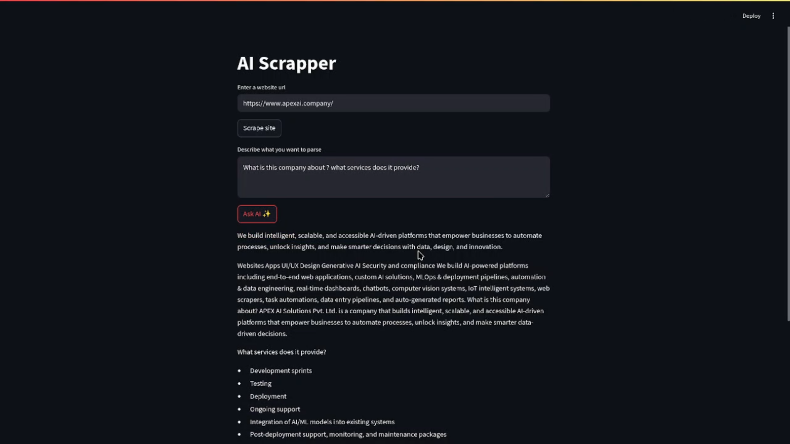
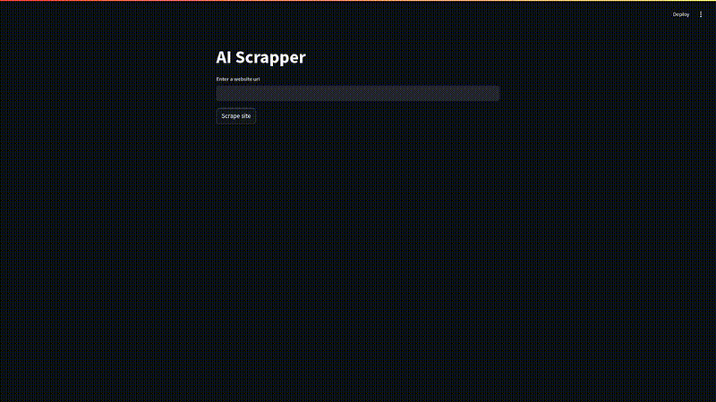

# 🕷️ AI Scraper: Web Crunching with Brains!



**AI Scraper** is your go-to tool for ripping through websites and pulling out exactly what you need. Built with **Streamlit**, **Selenium**, and **BeautifulSoup**, it scrapes, cleans, and parses web content using either **Groq’s API** for cloud-powered speed or **Ollama’s LLaMA3** for local AI muscle. Describe what you want in plain English, and let the AI do the heavy lifting!

## 🚀 Why It Rocks

- 🕸️ **Scrape Any Site**: Grab raw HTML from any URL with a headless browser.
- 🧼 **Clean It Up**: Strip out scripts, styles, and junk for pristine text.
- 📜 **Peek at the DOM**: View the cleaned content in a neat, expandable UI.
- 🧠 **Smart Extraction**: Ask for specific data (e.g., “Grab all product prices”) and get it, thanks to Groq or Ollama.
- ⚡ **Dual AI Modes**: Cloud-based Groq API for speed or local Ollama for privacy.

## 🧱 Project Structure

```bash
ai-scraper/
├── groq api/                # Cloud-powered scraping with Groq
│   ├── main.py              # Streamlit app for Groq
│   ├── parse_w_groq.py      # Groq API parsing logic
│   ├── scrape.py            # Web scraping and cleaning
├── local with ollama/       # Local AI with Ollama
│   ├── main.py              # Streamlit app for Ollama
│   ├── parse.py             # LLaMA3 parsing logic
│   ├── scrape.py            # Web scraping and cleaning
├── requirements.txt         # Python dependencies
└── README.md                # You’re here!
```

## ⚙️ Requirements

- **Python**: 3.11+
- **Chrome + ChromeDriver**: Configured at `/usr/bin/chromedriver` (tweak in `scrape.py` if needed).
- **Groq API Key** (Groq mode): Stored in a `.env` file.
- **Ollama** (local mode): LLaMA3 model installed and running.
- **Dependencies** (from `requirements.txt`):
  - `streamlit`
  - `beautifulsoup4`
  - `selenium`
  - `langchain`
  - `langchain-community`
  - `langchain-core`
  - `langchain-ollama`

## 🧪 Installation

1. **Clone the Repo**:

   ```bash
   git clone https://github.com/yourusername/ai-scraper.git
   cd ai-scraper
   ```

2. **Set Up a Virtual Environment (optional but recommended)**:

   ```bash
   python -m venv venv
   source venv/bin/activate  # On Windows: venv\Scripts\activate
   ```

3. **Install Dependencies**:

   ```bash
   pip install -r requirements.txt
   ```

4. **Set Up ChromeDriver**:
   Install ChromeDriver and ensure it’s at /usr/bin/chromedriver or update the path in scrape.py.

5. **For Groq API**:
   Create a .env file in `groq api/`:

   ```bash
   GROQ_API_KEY=your-groq-api-key
   ```

6. **For Ollama**:
   Install Ollama and pull LLaMA3:
   ```bash
   ollama pull llama3
   ollama run llama3
   ```

## ✍️ How to Use

1. **Fire It Up**:

   - For Groq API:

     ```bash
     cd groq\ api
     streamlit run main.py
     ```

   - For Ollama:
     ```bash
     cd local\ with\ ollama
     streamlit run main.py
     ```

2. **Scrape & Parse**:

   - Open http://localhost:8501 in your browser.
   - Enter a URL (e.g., https://example.com) and hit Scrape Site.
   - Check the cleaned DOM content in the expandable section.
   - Type what you want to extract (e.g., “List all email addresses”) and click Parse Content.
   - Boom! Your results appear.

## 🧠 Example Use Cases

- 🛒 Scrape product names and prices from e-commerce sites.
- 📰 Summarize articles or extract headlines from news pages.
- 📧 Pull contact info or FAQs from business websites.

## 🔒 Notes

- **Chunking**: Large pages are split into 3000-character chunks for efficient parsing.
- **Groq vs. Ollama**: Groq’s fast but needs internet; Ollama’s local but needs a beefy machine.
- **Respect the Web**: Check robots.txt and site terms before scraping.
- **Limitations**: Not optimized for JavaScript-heavy sites or SPAs requiring dynamic rendering.

## 🛠️ Troubleshooting

- **ChromeDriver Issues**: Ensure ChromeDriver matches your Chrome version.
- **Ollama Errors**: Verify LLaMA3 is running (`ollama run llama3`).
- **Vague Results**: Refine your parse description for better LLM accuracy.

## Demo


